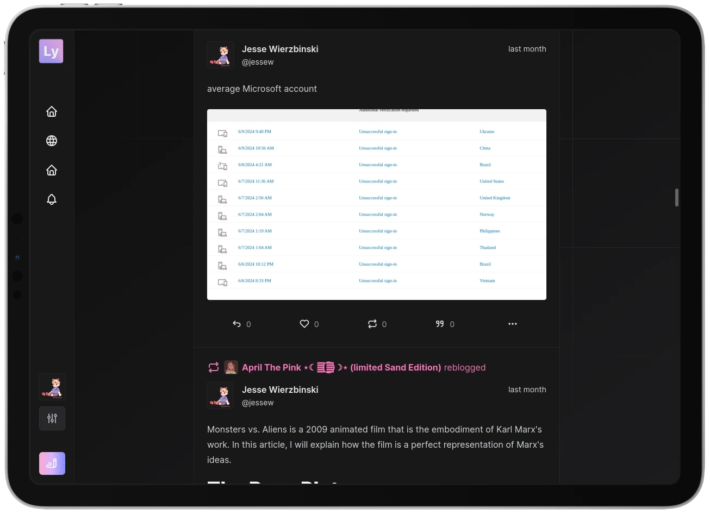

  

  <strong>A complete, simple and easy to use federation protocol.</strong>

    
    
    
    
    
    
    
    
    

### Repositories

- [`lysand-org/server`](https://github.com/lysand-org/server): Versia Server, the flagship implementation of the Versia protocol.
- [`lysand-org/docs`](https://github.com/lysand-org/docs): Documentation for the Versia Protocol.
- [`lysand-org/api`](https://github.com/lysand-org/api): TypeScript developer SDKs for federation and client software.
- [`lysand-org/activitypub`](https://github.com/lysand-org/activitypub): ActivityPub bridge for Versia Server.

 

    

